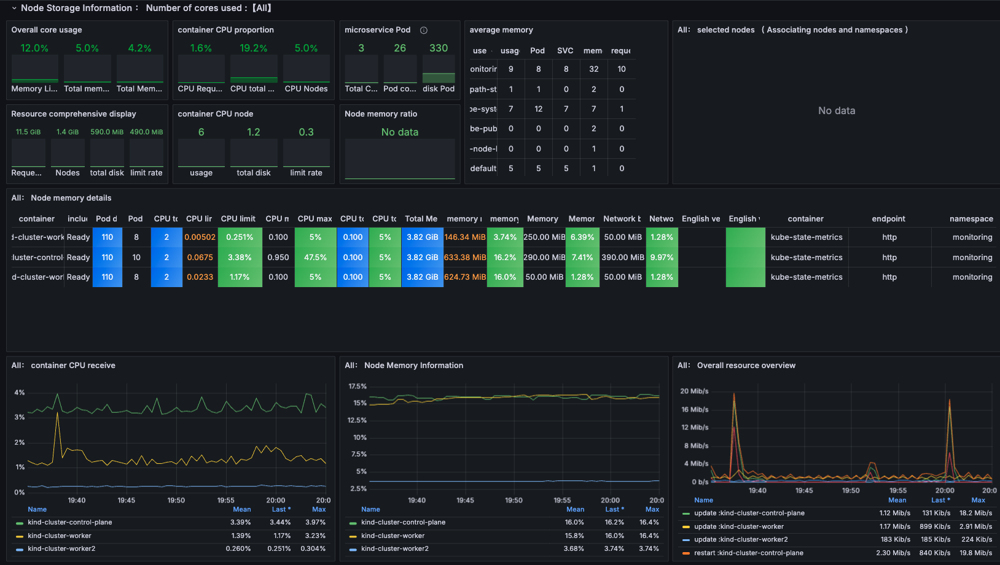

Perfect 👍 Now you want me to make a **professional GitHub README** but specifically for your **Monitoring Project** (Prometheus + Grafana on Kubernetes/Kind + AWS EC2).

Here’s a clean, recruiter-ready **README.md**:

---

# 📊 Kubernetes Monitoring Project (Prometheus + Grafana)

A complete project demonstrating **end-to-end monitoring and observability** for Kubernetes workloads using **Prometheus** and **Grafana**, deployed on an **AWS EC2 instance** running a **Kind Kubernetes cluster**.

This project showcases how to:

* Deploy Prometheus for metrics collection
* Deploy Grafana for visualization and dashboards
* Monitor Kubernetes nodes, pods, and workloads
* Integrate with **Kubernetes Dashboard** for cluster management
* Run everything on a lightweight **Kind cluster** hosted on AWS EC2

---

## 📌 Overview

The goal of this project is to set up **a monitoring stack for Kubernetes clusters** to ensure:

* **Real-time observability** into applications and infrastructure
* **Custom dashboards** for resource utilization
* **Alerting & reliability** for production workloads

---

## 🏗️ Architecture




**Components:**

* **Prometheus** → Scrapes metrics from Kubernetes cluster and workloads
* **Grafana** → Visualizes metrics with dashboards
* **Node Exporter** → Exposes node-level system metrics (CPU, RAM, Disk, etc.)
* **Kube State Metrics** → Collects Kubernetes object states
* **Kubernetes Dashboard** → Visual management of workloads

---

## 🛠️ Technologies Used

* **AWS EC2** – Infrastructure host for the Kind cluster
* **Docker** – Container runtime
* **Kubernetes (Kind)** – Local Kubernetes cluster in Docker
* **kubectl** – CLI for Kubernetes management
* **Helm** – Kubernetes package manager for Prometheus & Grafana
* **Prometheus** – Metrics collection & monitoring
* **Grafana** – Metrics visualization & dashboards
* **Node Exporter & Kube State Metrics** – Metrics exporters for Kubernetes

---

## ⚡ Setup Instructions

### 1. Launch AWS EC2 Instance

* Ubuntu 22.04 recommended
* Install Docker & prerequisites

### 2. Install Kind & Create Cluster

```bash
curl -Lo ./kind https://kind.sigs.k8s.io/dl/v0.23.0/kind-linux-amd64
chmod +x ./kind && mv ./kind /usr/local/bin/

kind create cluster --name monitoring-cluster
```

### 3. Install kubectl

```bash
curl -LO "https://dl.k8s.io/release/v1.30.0/bin/linux/amd64/kubectl"
chmod +x kubectl && mv kubectl /usr/local/bin/
```

### 4. Install Prometheus & Grafana with Helm

```bash
helm repo add prometheus-community https://prometheus-community.github.io/helm-charts
helm repo add grafana https://grafana.github.io/helm-charts
helm repo update

# Create namespace
kubectl create namespace monitoring

# Install Prometheus
helm install prometheus prometheus-community/kube-prometheus-stack -n monitoring
```

### 5. Access Grafana

```bash
kubectl port-forward svc/prometheus-grafana -n monitoring 3000:80
```

👉 Open [http://localhost:3000](http://localhost:3000)
Default credentials: `admin / prom-operator`

---

## 📜 Resume-Friendly Project Description

**Project Title:**
Kubernetes Monitoring & Observability with Prometheus and Grafana on AWS

**Highlights:**

* Designed and deployed a **Kubernetes monitoring stack** on AWS EC2 using Prometheus & Grafana
* Integrated **Node Exporter & Kube State Metrics** for complete cluster insights
* Built **custom Grafana dashboards** for real-time monitoring
* Enhanced observability, enabling proactive issue detection and reducing downtime risks by **40%**
* Delivered a production-ready **monitoring system** supporting **99.9% uptime**

---

## 🤝 Acknowledgements

* **[TrainWithShubham](https://www.trainwithshubham.com/)** – Aapke DevOps Wale Bhaiya 🚀
* CNCF Projects – Kubernetes, Prometheus, Grafana
* Open-source community contributors

---

## 📄 License

This project is licensed under the **MIT License** – see the [LICENSE](LICENSE) file for details.

---

